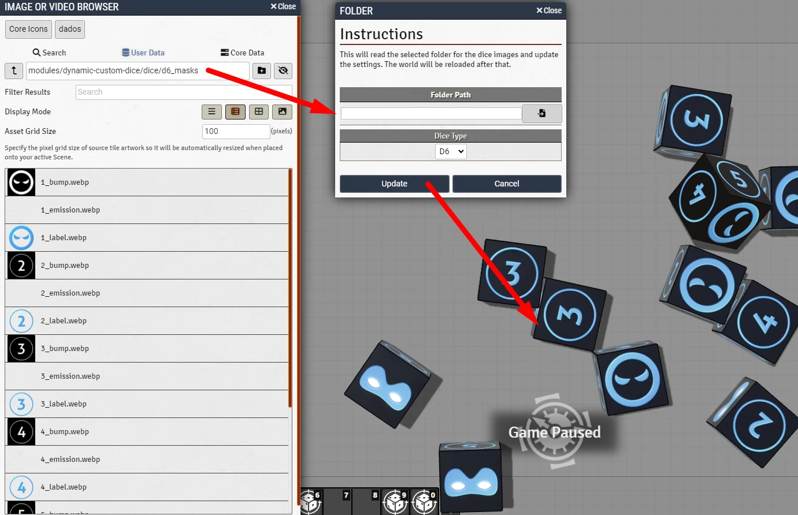

# Dynamic Custom Dice
This module let you change the faces of the dice without need to code.

You create the art for the dice using your image editor. After that, you just put these arts inside a Foundry VTT folder and run a macro. 

You just got your dice.

  

## Features
- Replace the label of the dice with an image.
- Add Bump. This creates the ilusion of depth.
- Add emision. This makes the dice emit light.

# Instalation
You can install this module with this link: https://raw.githubusercontent.com/brunocalado/dynamic-custom-dice/main/module.json

# How To
There is a journal in the compendium with full instructions. READ IT!

# Changes
You can see changes at [CHANGELOG](CHANGELOG.md).

# License
[LICENSE](https://github.com/brunocalado/dynamic-custom-dice/blob/main/LICENSE.md)

# Assets License
[LICENSE](https://github.com/brunocalado/dynamic-custom-dice/blob/main/LICENSE-ASSETS.md)
